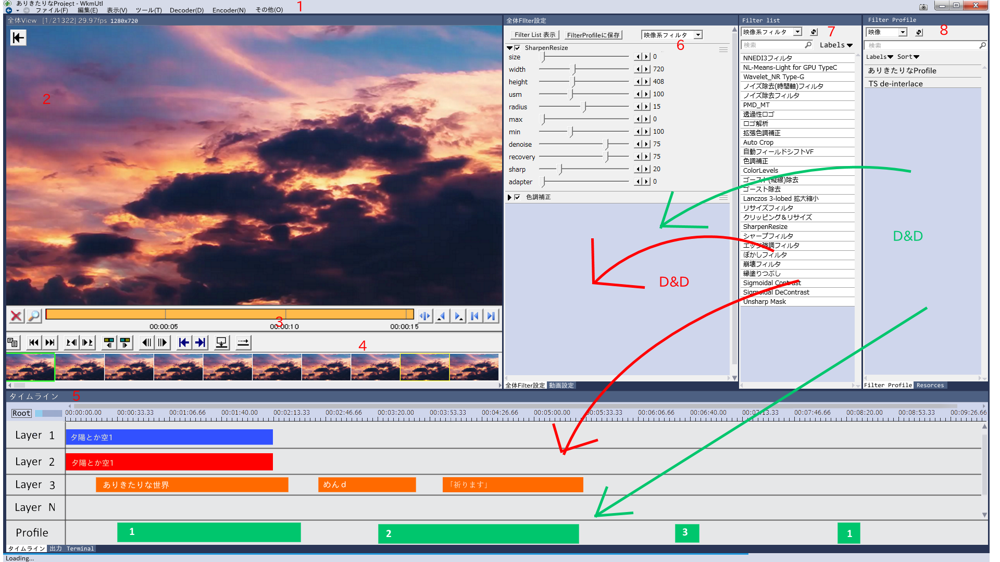

# yumetodo's DesignConcept01
There is a funny expression. Excuse me.

## Principles
1. Simple and intuitive (i.e. No Adobe layout)
2. Easy for existing AviUtl users to adapt
3. Get rid of the distinction between the built-in Filter and Plugin Filter
4. Add ``Filter List``. Introduced **Label** system

## Existing UI deficiency
1. Plugin list can be way too long
2. MOST of the AviUtl new users cannot retrieve back the NLE panel after closing it
3. Profile workflow is not so intuitive
5. Many users unaware of the importance of Filter Order
6. Each plugin can only be invoked once by user
7. Plugin setting dialog is minimalistic, and get elongated when too many controls set on it
8. Many of Window to be flood. It's could become the main work to organize the Windows.

## UI Layout description

### 1
- Meue
- Tool bar is not necessary, because it does not exist in AviUtl.

### 2
- Preview
- Although not written in the figure, it might be good to put much playback button (integration with Play Window)

### 3
- Seek bar
- ``AviUtl Seekbar`` is difficult to use. So, I suggest replacing that to [cutedit.auf](http://aviutl.web.fc2.com/).

### 4
- The panels for plugins.
- It's usefull to add ``seek bar`` as plugin.
- In the image, we have placed tentatively [jump.auf](http://videoinfo.tenchi.ne.jp/index.php?%A5%B8%A5%E3%A5%F3%A5%D7%A5%A6%A5%A3%A5%F3%A5%C9%A5%A6).

### 5
- The panels for things elongated in the transverse
- In the image, Something like ``拡張編集`` is shown(Will this be Plugin!?).
- Besides ``タイムライン``, I have assumed ``OutPut``(It will be used to display Debug-Print and the information not be enough to pop-up. Please imagine the thing of Visual Studio) and ``Terminal``(It will be usefull to add package-system as a plugin. Please imagine ``Package Control`` of Sublime Text).

### 6
- General Filter Setting
- You can sort manually by grabbing and dragging the ``三`` symbol.
- **DO NOT CREATE another window** to set param of filter.
- Classified ``Video``, ``Sound``, and ``Other``.
- Support　to export settings(Filter's order, param, etc...) to ``Filter Prifile``(later mention)

### 7
- List of Filter
- Classified ``Video filter``, ``Sound filter``, and ``Other``.
- Add Search bar.
- **Introduced Label system**(Please imagine the thing of GitHub Issue)
- Apply FIlter by D&D to ``General Filter Setting``(6), ``Timeline``(5) and ``Movie Setting``(9, later mention)

### 8
- Filter Prifile
- Rename ``Profile``(What's Prifile??) to ``Filter Prifile``.
- Apply Profile by D&D to ``General Filter Setting``(6), ``Timeline``(5) and ``Movie Setting``(9, later mention)
- **Introduced Label system** and Auto-Sort system.(Please imagine the things of GitHub Issue)
- Add Search bar.
- Classified ``Video``, ``Sound``, and ``Other``.

### 9
- Movie Setting
- Since teamed design on the assumption that incorporates ``拡張編集``, I thought this layout
- When you double-click the Video-Object, this window will be open.
- When you double-click the Video-Object, ``Seek Bar``(3) will be switch.It becomes easier cut editing of the video object.

### 10
- Resources
- Every files will be list-up automatically when you D&D files to the window of WkmUtl.
- You can add Test-Object of Timeline to Resources **manually**.
- Classified ``Video``, ``Sound``, ``Text``, and ``Other``.(Plugin extensible)
- In Video Tab, display thumbnail if thumbnail is exist.(Is it possible?)
- In Video Tab, **display input plugin name**.
- You can switch styles between the Images and ``Detail mode``(Please imagine the thing of Explolor(Windows))
- Add Search bar.
- **Introduced  Auto-Sort system system**(Please imagine the thing of GitHub Issue)

### 11
- Progress Bar
- For loading, exporting and etc...
- Please imagine Minimal of [PACE](http://github.hubspot.com/pace/docs/welcome/).

### Other thoughts
- I entirely agree with the opinion that it is written in "Other" of @MaverickTse.
- Get rid of the distinction between the built-in Filter and Plugin Filter
- Design of color scheme to write to json(or other), so that it can be distributed as a skin
- In Images, I adopt Visual Studio-style color scheme.
- Able to take the entire of WkmUtl screen shot.(This will help users to ask a question)
- To avoid ``Missing 拡張編集 Case``, I suggest to implement built-in Timeline(like ``拡張編集``).