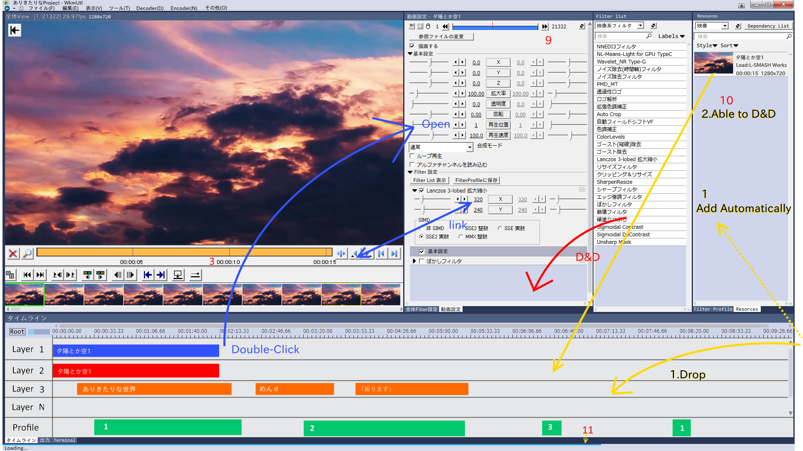

# yumetodo's DesignConcept01

## コンセプト
1. 簡単で分かりやすい
2. AviUtl使用者に優しい
3. 孤立Windowを乱立させない
4. 本体内蔵FilterとPlugin Filterの区別をなくす
5. Filter Listを追加、ラベル付できるように

## AviUtl　UI　の問題点
1. プラグインリストが段々長くなる
2. 初心者大半が拡張編集を一度閉じると、二度と見つかない
3. プロフィールの設定や利用方法が分かりにくい
4. プラグイン優先順の大事さよく忘れされる
5. プラグインが一度実行しか出来ない。AviSynth様にコマンド何度も呼び出せるのことできない。
6. 複雑なプラグインのUIは…麺のように伸びる
7. **とにかくWindowが乱立する**。Windowsの整理がメイン作業になりかねない

## UI の説明

### 1
- メニュー
- ツールバーはAviUtlにもないので作らない。ただし戻る/進むボタンだけ追加

### 2
- Preview画面
- 図には書いてないけど再生ボタンくらいつけてもいいかもしれない(再生Windowとの統合)

### 3
- シークバー
- AviUtlのシークバーは使いにくいので、[cutedit.auf](http://aviutl.web.fc2.com/)に差し替え

### 4
- Plugin向けのWindow表示場所
- Pluginでシークバー追加したりするのに便利そう。
- 仮に[jump.auf](http://videoinfo.tenchi.ne.jp/index.php?%A5%B8%A5%E3%A5%F3%A5%D7%A5%A6%A5%A3%A5%F3%A5%C9%A5%A6)をおいてある。

### 5
- 細長いもの向けWindow
- 拡張編集みたいなのを表示させている(これPluginになるの!?)
- 他には「出力」(Pluginデバッグ用やポップアップするほどではない情報表示に。Visual Studioのものをイメージしてください)や  
「Terminal」(Sublime TextのPackage ControlみたいのをPluginとして実装するときにあると便利そう)を想定

### 6
- Filter設定
- スマホでお馴染み、よこの「三」をつかんで並べ替えられる
- FIlterのパラメータは**別Windowにしない**。
- 「映像系フィルタ」「音声系フィルタ」「その他」に分ける
- FIlterの順序・パラメータを保存する、Filter Prifile(後述)への出力機能をつける

### 7
- Filterリスト
- 「映像系フィルタ」「音声系フィルタ」「その他」に分ける
- 検索機能追加
- **ラベル分けできるように**(GitHub　IssuesのLabelsを想定)
- D&Dで、Filter設定(6)やタイムライン(5)や動画設定(9 後述)にフィルタを適用する

### 8
- Filter Prifile
- AviUtlの「プロファイル」は名称が謎だったので改名
- 全体フィルタ設定や動画設定(後述)やタイムラインにD&Dすることで適応できる
- **Label, Sort機能をつける**(GitHub　IssuesのLabels, Sortを想定)
- 検索機能追加
- 「映像」「音声」「その他」に分ける

### 9
- 動画設定
- 拡張編集を内蔵する前提でデザイン組んだのでこれのレイアウトも考えた
- 「タイムライン」のObjectをダブルクリックすれば開く
- 動画objectを開いた時は3のシークバーと連携。動画objectのカット編集が楽になる

### 10
- リソース
- WkmUtl全体のどこかにD&Dされたファイルはすべてここに追加される
- タイムラインのテキストオブジェクトとかも**手動で**追加できる
- 「映像」「音声」「テキスト」「その他」に分ける(Plugin拡張可能)
- 映像はサムネイルも表示(無いものは省略・・・できるのか?)
- **映像はinput Plugin名表示**
- 「Style」ボタンでWindowsのexplolorの詳細表示みたいなデザインも可能に
- 検索機能追加
- **Sort機能をつける**(GitHub　IssuesのSortを想定)

### 11
- Progress bar
- 動画読み込みとか出力時とかの進行状況表示に
- イメージは[PACE](http://github.hubspot.com/pace/docs/welcome/)のMinimal

### その他
- @MaverickTse 氏の「その他」に書いてある意見に全面同意
- 本体内蔵FilterとPlugin Filterの区別をなくす
- デザインの配色はjsonかなにかにまとめて、skinとして配布できるように
- 今回はVisual Studioとおなじ配色にした
- WkmUtl全体のscreen Shotを撮れるように(利用者が質問を投げやすいように)
- 拡張編集行方不明事件を起こさないために、拡張編集相当のものを内蔵することを提案
